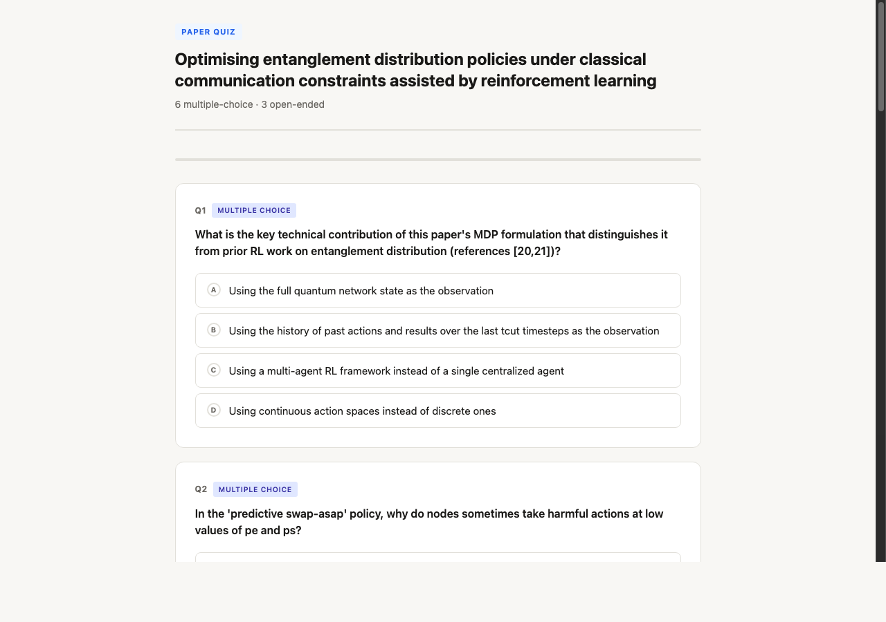

# paper-quiz

A Claude Code skill that turns any academic paper into an interactive browser-based quiz — powered by Claude Opus.



## What it does

Give it a PDF path or arXiv URL. It reads the paper with Claude Opus, generates a quiz of multiple-choice and open-ended questions grounded in the paper's content, writes a self-contained HTML file, and opens it in your browser automatically.

- **6–10 questions** per paper (5–7 MCQ + 3 open-ended)
- **Auto-graded MCQ** with explanations revealed on submit
- **Open-ended** questions show a model answer + key points for self-assessment
- **Zero dependencies** — output is a single portable HTML file
- **Runs entirely offline** after generation

## Usage

```
/paper-quiz path/to/paper.pdf
/paper-quiz https://arxiv.org/pdf/2301.07041
```

## Installation

Install via the Claude Code plugin system:

```bash
claude plugins install chrishalkias/paper-quiz
```

Then use the `/paper-quiz` slash command in any Claude Code session.

## How it works

```
/paper-quiz <input>
      │
      ├─ Detect: file path or URL
      ├─ Read: PDF (Read tool) or URL (WebFetch)
      │
      ▼
  tester agent (Claude Opus)
      │  Paper text → JSON quiz
      │  { paper_title, questions: [mcq…, open…] }
      │
      ▼
  quiz-template.html
      │  Inject JSON, write /tmp/paper-quiz-<ts>.html
      │
      └─ open in browser
```

The `tester` subagent runs on **Claude Opus** for best comprehension of dense academic content. The main orchestration runs on whatever model you have active.

## Project structure

```
paper-quiz/
  SKILL.md               # Skill definition — orchestration steps
  quiz-template.html     # Self-contained quiz UI (vanilla JS, no CDN)
  agents/
    tester.md            # Opus subagent — paper → quiz JSON
  docs/
    quiz-preview.png
```

## Quiz format

**Multiple-choice questions** cover:
- Core contribution and novelty
- Key methodology
- Main results and numbers
- Limitations
- Relationship to prior work

**Open-ended questions** require:
- Synthesis across sections
- Critical reasoning about design choices
- Comparison with alternatives

After submitting, MCQ answers are highlighted ✓/✗ with explanations. Open-ended questions reveal a model answer and a checklist of key points for self-assessment.

## Requirements

- Claude Code with access to Claude Opus (for the `tester` subagent)
- A browser (quiz opens automatically via `open` / `xdg-open`)
